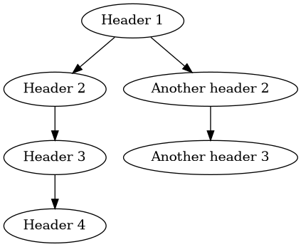

# Markdown to Graph

A completely useless program that draws a graph with the headers of a markdown file.

**NOTE**: the program assumes that the markdown file is written according to the following rules:

- There are no multiple top level headings in the same document
- The first line of the document contains the top level header
- Heading levels should only increment by one level at a time

## Requirements

- `python3`
- [`dot`](https://linux.die.net/man/1/dot): to draw graphs

## Usage

`python markdown_to_graph.py input.md output.png`

## Example

```markdown
# Header 1

## Header 2

### Header 3

#### Header 4

## Another header 2

### Another header 3
```

Becomes



## Installation

`chmod +x markdown-to-graph.py`

`sudo cp markdown-to-graph.py /usr/local/bin/md2graph`
